# Run AlphaFold on AWS Deep Learning EC2

After the publication of the [Nature Article](https://www.nature.com/articles/s41586-021-03819-2) and open source of [AlphaFold](https://deepmind.com/research/case-studies/alphafold) on [github](https://github.com/deepmind/alphafold), there has been tremendous interest in the scientific community to try AlphaFold out first hand. With the easy access to compute resources on AWS with NVidia GPUs, it is one of easiest and fastest ways to get AlphaFold running and try things out yourself.

In this step-by-step instruction, we will show you have to install AlphaFold on an AWS Deep Learning EC2 instance with GPU and run predictions using AlphaFold with CASP14 samples. We will also show you have to create snapshot for future use to reduce the effort of setting it up again and save cost. 

> If you are not interested in the process of setting up the EC2 environment from scratch, but would like to run AlphaFold as soon as possible. Jump to [Recreate a new Deep Learning EC2 with snapshot of data volume](#recreate-a-new-deep-learning-ec2-with-snapshot-of-data-volume) section and use the provided public snapshots to create the EC2.

## Launch AWS Deep Learning EC2 Instance

In this section, we will demonstrate how to set up an AWS EC2 instance using one of pre-built Deep Learning AMI (Amazon Machine Image) from AWS. It already has lots of the AlphaFold dependencies installed and will save lots of time for the setup.

1. Go to [AWS EC2 console](https://console.aws.amazon.com/ec2). In the AWS region of your choice, launch a new EC2 instance with Deep Learning AMI by searching `Deep Learning AMI`. In the steps below, we will use a Deep Learning AMI based on Ubuntu 18.04.

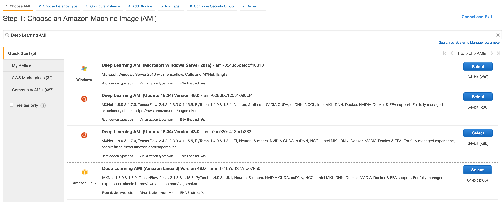

2. Choose **p3.2xlarge** with 1 GPU as the instance type.

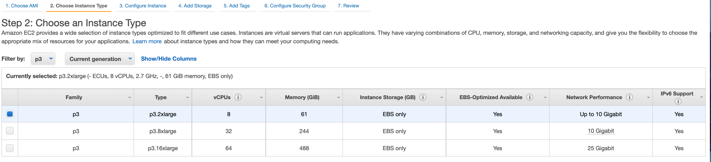

3. Configure the proper VPC setting based on your AWS environment requirements. 

4. Set the system volume to 200GB and add one new data volume of 3TB (3072GB) in size.  

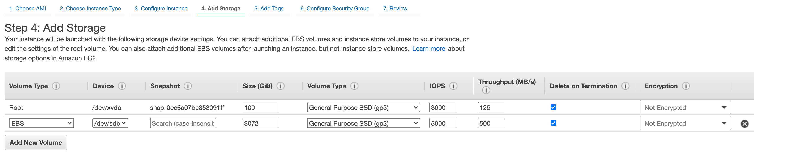

5. Make sure the security group settings allow you to access the EC2 instance with SSH and it could reach the internet to install AlphaFold and other packages. Launch the EC2.

6. Wait for the EC2 instance to become ready and SSH to the EC2 terminal.

6. (Optional) If you have internal security controls that are required, install them now.

## Install AlphaFold

1. Inside EC2 terminal. first update all packages to the latest

```
sudo apt update
```

2. Mount the data volume to folder `/data`. For more details, please reference [AWS Documents](https://docs.aws.amazon.com/AWSEC2/latest/UserGuide/ebs-using-volumes.html)

Use the lsblk command to view your available disk devices and their mount points (if applicable) to help you determine the correct device name to use.
```
lsblk
```
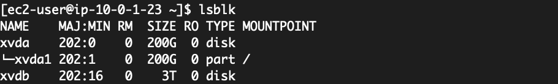

Determine whether there is a file system on the volume. New volumes are raw block devices, and you must create a file system on them before you can mount and use them. 
```
sudo file -s /dev/xvdb
```
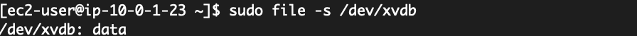

The device is an empty volume, we will create a file system on the volume and mount the volume to `/data` folder.
```
sudo mkfs.xfs /dev/xvdb
sudo mkdir /data
sudo mount /dev/xvdb /data
sudo chown ubuntu:ubuntu -R /data
df -h /data
```

3. Install AlphaFold dependencies and other tools 

```
sudo apt install aria2 rsync git vim wget tmux tree -y
```

4. Create working folders, clone AlphaFold code from github and download the data using provided scripts in the background. We'll use the new volume exclusively.

```
cd /data
mkdir -p /data/af_download_data
mkdir -p /data/output/alphafold
mkdir -p /data/input
git clone https://github.com/deepmind/alphafold.git
```

5. AlphaFold needs multiple genetic (sequence) database and model parameters. Download them using the provided script. 

``` 
nohup /data/alphafold/scripts/download_all_data.sh /data/af_download_data &
```

The whole download process could take over 10 hours, wait for it to finish ...

You could use the command below to monitor the download and unzip process

```
du -sh /data/af_download_data/*
```

Once all the download process finishes, you should have the following files in your `/data/af_download_data` folder  

```
$DOWNLOAD_DIR/                             # Total: ~ 2.2 TB (download: 438 GB)
    bfd/                                   # ~ 1.7 TB (download: 271.6 GB)
        # 6 files.
    mgnify/                                # ~ 64 GB (download: 32.9 GB)
        mgy_clusters_2018_12.fa
    params/                                # ~ 3.5 GB (download: 3.5 GB)
        # 5 CASP14 models,
        # 5 pTM models,
        # LICENSE,
        # = 11 files.
    pdb70/                                 # ~ 56 GB (download: 19.5 GB)
        # 9 files.
    pdb_mmcif/                             # ~ 206 GB (download: 46 GB)
        mmcif_files/
            # About 180,000 .cif files.
        obsolete.dat
    small_bfd/                             # ~ 17 GB (download: 9.6 GB)
        bfd-first_non_consensus_sequences.fasta
    uniclust30/                            # ~ 86 GB (download: 24.9 GB)
        uniclust30_2018_08/
            # 13 files.
    uniref90/                              # ~ 58 GB (download: 29.7 GB)
        uniref90.fasta
```

6. Update `/data/alphafold/docker/run_docker.py` to make the configuration matching the local path

```
vim /data/alphafold/docker/run_docker.py
```

With the folders we created, the configurations will look like the following. If you have setup different folder structure in your EC2 instance, set it accordingly.
```
#### USER CONFIGURATION ####

# Set to target of scripts/download_all_databases.sh
DOWNLOAD_DIR = '/data/af_download_data'

# Name of the AlphaFold Docker image.
docker_image_name = 'alphafold'

# Path to a directory that will store the results.
output_dir = '/data/output/alphafold'
```
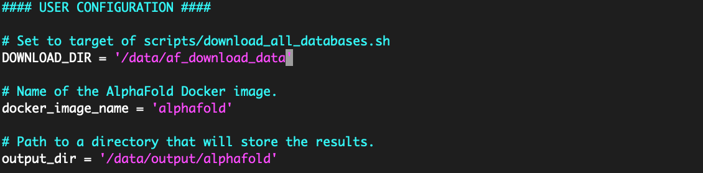

7. Confirm the NVidia container kit is installed. You should see somthing like the screen below

```
sudo docker run --rm --gpus all nvidia/cuda:11.0-base nvidia-smi
```


8. Build AlphaFold docker image. Make sure local path is `/data/alphafold` as there is a `.dockerignore` file under that folder. You should see the new docker image after build.

```
cd /data/alphafold
docker build -f docker/Dockerfile -t alphafold .
docker images
```
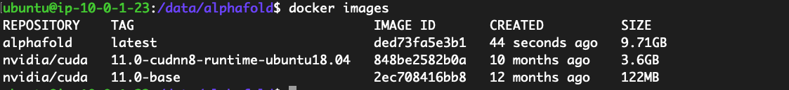

9. Use PIP to install all python dependencies
```
pip3 install -r /data/alphafold/docker/requirements.txt
```

10. Go to [CASP14 target list](https://www.predictioncenter.org/casp14/targetlist.cgi) and copy the sequence from the [plain text link for T1050](https://www.predictioncenter.org/casp14/target.cgi?target=T1050&view=sequence). 

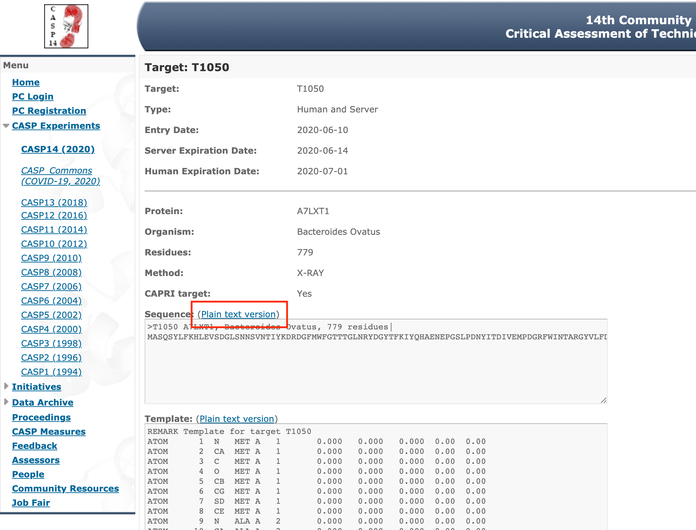

Copy it into new `.fasta` files and save it under `/data/input` folder.

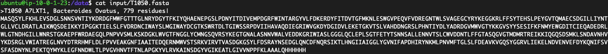

You can create a few more input `.fasta` files for testing.

## (Optional) Install CloudWatch monitoring for GPU

1. Create EC2 role for CloudWatch and attach to EC2 instance.

2. Change the region in gpumon.py if your instance is NOT in us-east-1. Provide a new Namespace like `AlphaFold`

```
vim ~/tools/GPUCloudWatchMonitor/gpumon.py
```


3. Launch gpumon
```
source activate python3
python ~/tools/GPUCloudWatchMonitor/gpumon.py &
```

## Use AlphaFold for prediction

1. Use the following command to run prediction of protein sequence from `/data/input/T1050.fasta`

```
nohup python3 /data/alphafold/docker/run_docker.py --fasta_paths=/data/input/T1050.fasta --max_template_date=2020-05-14 &
```

2. Use `docker ps` to monitor the container process
```
docker ps
```

```
tail -F /data/nohup.out
```

3. once the prediction finished, you should see the following in the output folder
```
<target_name>/
    features.pkl
    ranked_{0,1,2,3,4}.pdb
    ranking_debug.json
    relaxed_model_{1,2,3,4,5}.pdb
    result_model_{1,2,3,4,5}.pkl
    timings.json
    unrelaxed_model_{1,2,3,4,5}.pdb
    msas/
        bfd_uniclust_hits.a3m
        mgnify_hits.sto
        pdb70_hits.hhr
        uniref90_hits.sto
```

4. Copy the output folder to your local directory. 

You need to change owner of the output folder first so you could copy them. 
```
sudo chown ubuntu:ubuntu /data/output/alphafold/ -R
```

Download the output from the prediction output folder to local machine.
```
scp -i <ec2-key-path>.pem -r ubuntu@<ec2-ip>:/data/output/alphafold/T1050 ~/Downloads/
```

5. Use this [viewer](https://www.ncbi.nlm.nih.gov/Structure/icn3d/full.html) from NIH to view the predicted 3D strcuture from your result folder. We are going to pick `ranked_0.pdb` which contain the prediction with the highest confidence.

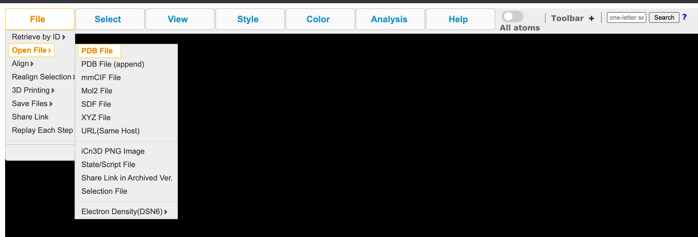

Below is the 3D view of the predicted structure for T1050 by AlphaFold.

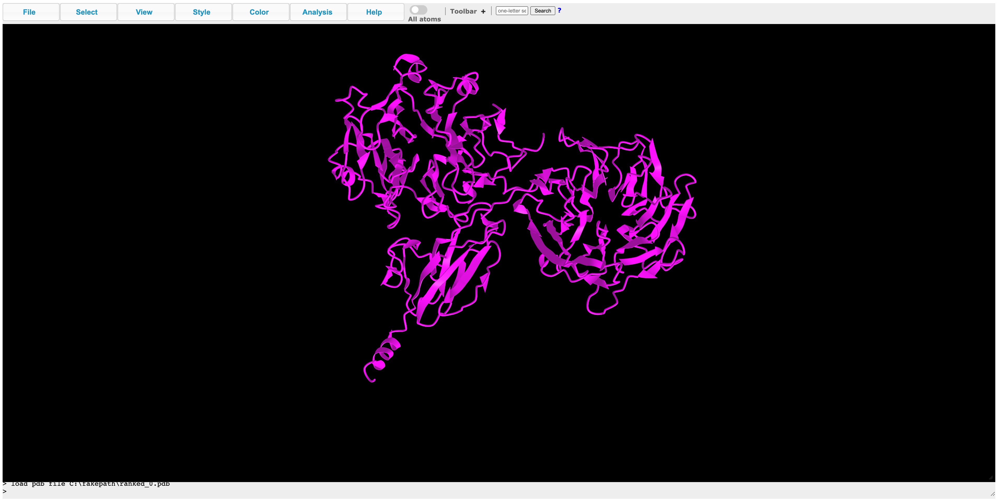

## Create snapshot of data volume

We spent a lot of time to create an EC2 instance with working version of AlphaFold. However, the P3 instance and the EBS volume are pretty expensive if we keep them running all the time. We want to have an instance ready quickly but also don't want to spend time we spent building up the environment every time we need it. An EBS snapshot will help us to save a lot of time.

Go to [AWS EC2 console](https://console.aws.amazon.com/ec2) and click **Volumes** on the left. Filter by the EC2 instance id and there should be 2 volumes. Select the data volume with 3TB in size. Click **Action** drop-down and click **Create snapshot**  

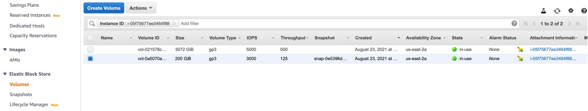

The snapshot will take a few hours to finish. After the snapshot is done, you could safely shutdown your EC2.

## Recreate a new Deep Learning EC2 with snapshot of data volume

To recreate a new EC2 with AlphaFold, the first couple steps are similar to what we did earlier when creating a EC2 from scratch. But instead of creating the data volume from scratch, we will attach a volume restored from the snapshot.

1. Go to [AWS EC2 console](https://console.aws.amazon.com/ec2). In the AWS region of your choice, launch a new EC2 instance with Deep Learning AMI by searching `Deep Learning AMI`. Choose the Deep Learning AMI based on Ubuntu 18.04.


2. Choose p3.2xlarge with 1 GPU as the instance type.


3. Configure the proper VPC setting based on your AWS environment requirements.

4. Set the system volume to 200GB. But no data volume this time.

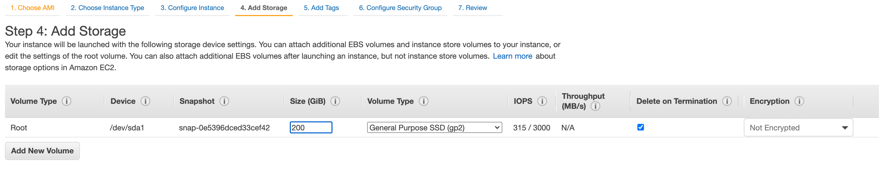

5. Make sure the security group settings allow you to access the EC2 instance and it could reach the internet to install python and docker packages. Launch the EC2.

6. Go to [AWS EC2 console](https://console.aws.amazon.com/ec2) and click **Snapshots** on the left. Select the snapshot you created earlier or use the public snapshot provided. 

> We provide public snapshots in **us-east-1** and **us-east-2** regions. Search by **Snapshot ID**  `snap-07e090f20449b0981` in **us-east-1**, or `snap-0319fdb0334298356` in **us-east-2**.

Click **Actions** drop-down and select **Create Volume**.

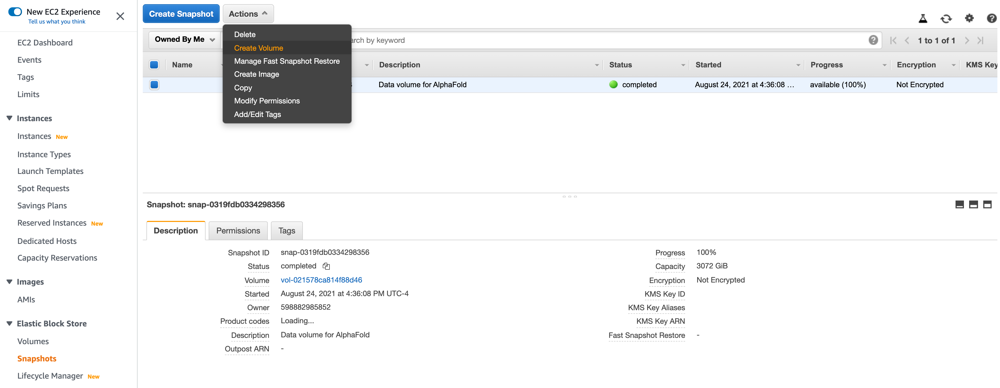

7. Set the new data volume setting accordingly. Make sure the **Availability Zone** is the same as the newly created EC2 instance, otherwise you will not be able to mount it to the new EC2 instance. Click **Create Volume** at the bottom to create the new data volume

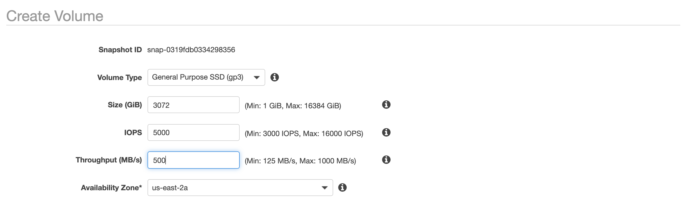

8. Click **Volumes** on the left and you should see the newly created data volume. Its state should be **available**. Select the volume, click **Actions** drop-down menu and click **Attach volume**. Choose the newly created EC2 and attach the volume

9. SSH into the newly created EC2 and run `lsblk`, you should see the new data volume unmounted. In this case, it is `/dev/xvdf`

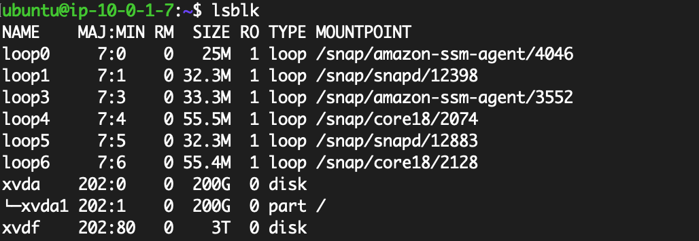

Determine whether there is a file system on the volume. The data volumes just created from snapshot has a file system on them already.

```
sudo file -s /dev/xvdf
```

10. Mount the new volume to `/data` folder

```
sudo mkdir /data
sudo mount /dev/xvdf /data
sudo chown ubuntu:ubuntu -R /data
```

11. Update the system and install dependencies. We need to rebuild the AlphaFold docker image.

```
sudo apt update
sudo apt install aria2 rsync git vim wget tmux tree -y
pip3 install -r /data/alphafold/docker/requirements.txt

cd /data/alphafold
docker build -f docker/Dockerfile -t alphafold .
docker images
```

12. Confirm the NVidia container kit is installed. You should see output like the screenshot below

```
sudo docker run --rm --gpus all nvidia/cuda:11.0-base nvidia-smi
```
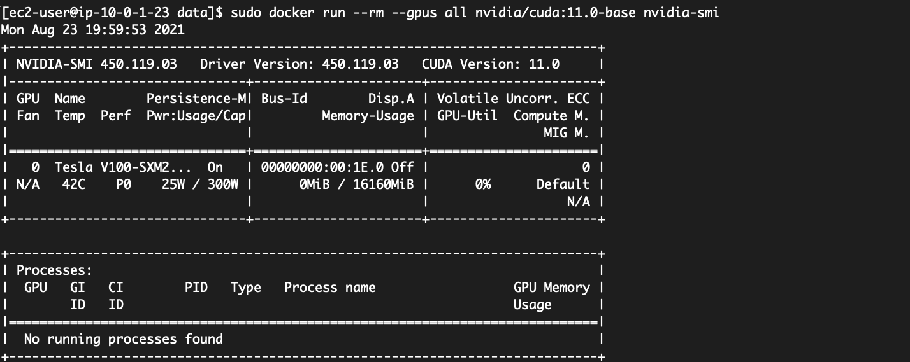

13. Use the following command to run prediction of protein sequence from `/data/input/T1024.fasta`. 

> Note: we use a different protein sequence as the snapshot contain the result from T1050 already. If you want to run the prediction for T1050 again, please first remove the result folder before run the new prediction.

```
cd /data
nohup python3 /data/alphafold/docker/run_docker.py --fasta_paths=/data/input/T1024.fasta --max_template_date=2020-05-14 &
```

14. Once you are done with all you predictions and save your results, you could safely shutdown the EC2. When you need to use AlphaFold again, you can follow the same process to spin up a new AWS EC2 and run new predictions. And you will not incur any cost other than the snapshot storage.
